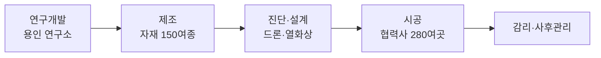
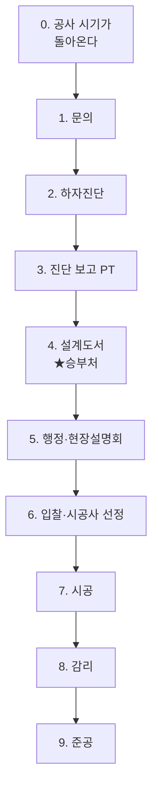

# 넷폼은 어떤 회사인가

2026-09-21 · 사내 온보딩용

---

## 한눈에 보기

넷폼은 **건축물을 고쳐서 오래 쓰게 만드는 기술과 재료를 직접 개발해 파는 회사**다. 주력 시장은 아파트 유지보수 — 옥상 방수, 외벽 재도장, 균열 보수, 지하주차장 바닥 같은 공사다.

직접 시공하는 건설사가 아니라, 공법과 자재를 만들어 전국 협력사에 공급하고, 동시에 아파트 현장을 직접 진단·설계해주는 구조를 가졌다.

| 항목 | 내용 |
| --- | --- |
| 법인명 | 주식회사 넷폼 (Netform) |
| 이전 사명 | 넷폼알앤디 — 2026년 8월 4일 변경 |
| 대표 | 이승우 |
| 설립 | 2021년 1월 21일 |
| 본사 | 경기 오산시 서동로 77 |
| 공장·기술연구소 | 경기 용인시 처인구 남사읍 당하로 135-5 |
| 서울지사 | 서울 서초구 강남대로51길 10 |
| 산업분류 | 기타 공학 연구개발업 (M70129) |
| 인원 | 약 32명 |
| 슬로건 | Better Spaces, Safer Lives — 더 나은 공간, 더 안전한 일상 |

국토교통부 고시나 KAIA 검색 같은 공공기록에는 아직 옛 사명인 넷폼알앤디가 남아 있다. 외부 문서에서는 처음 나올 때 넷폼(구 넷폼알앤디)로 병기하는 편이 안전하다.

관계 법인의 대표가 각각 다르다. 넷폼은 이승우, 슈어포인트는 이상혁, 스퀘어건축사사무소는 조현식이다.

---

## 무슨 일을 하는 회사인가

사업 영역을 한 단어로 말하면 **건축물 MRO**다. Maintenance, Repair, Operation — 유지·보수·운영. 새 건물을 짓는 것이 아니라 이미 지어진 건물을 오래 쓰게 만드는 일이다.

넷폼은 이 일을 한 흐름으로 연결해 가지고 있다.

이 다섯 단계를 다 갖춘 회사는 드물다. 보통은 자재만 만들거나, 설계만 하거나, 시공만 한다.

### 직접 시공하는 회사가 아니다

가장 먼저 알아두어야 할 구조다. 넷폼은 32명이고, 누적 시공은 280만 세대다. 산술이 맞지 않는다.

실제로는 **넷폼이 기술과 자재를 공급하고, 전국 280여 곳의 협력사가 시공한다.** 그래서 사내 원칙으로도 POUR공법을 설명할 때 책임시공이라고 하지 않고 전문 기술공법이라고 표현한다.

다만 POUR솔루션 브랜드로 발주처를 직접 수주할 때는 진단부터 시공까지 직접 관리한다. 두 가지 방식을 동시에 운영한다. 단, 감리는 아파트스퀘어만 맡는다.

### 수익은 어디서 나오는가

2025년 기준 누적 거래액은 850억, 매출은 148억이다. 이 차이가 구조를 보여준다. 협력사가 850억짜리 공사를 하고, 넷폼은 거기 들어가는 자재와 기술로 148억을 번다.

공사비를 받는 회사가 아니라 **공사에 들어가는 재료를 파는 회사**라고 보면 된다.

---

## 시장을 알아야 하는 이유 두 가지

시장 이야기는 길게 할 필요 없다. 실무에 쓰이는 건 두 가지다.

### 1. 공사는 법으로 정해져 있다

아파트 수선공사는 물이 새면 하는 게 아니라 **정해진 주기에 의무적으로** 한다. 300세대 이상은 장기수선계획을 세워 3년마다 검토하고, 그 돈(장기수선충당금)을 매달 적립한다.

그리고 그 돈을 쓰려면 사용계획서를 써야 하는데, 거기 **설계도면과 예정공사금액**이 반드시 들어간다.

> 즉 우리가 파는 설계도서는 있으면 좋은 서비스가 아니라 **법이 요구하는 서류**다. 영업할 때 이 한 줄이 가장 강하다.

### 2. 공사를 발주하는 사람은 비전문가다

발주 주체는 입주자대표회의(동대표)와 관리사무소다. 본업이 따로 있는 주민이거나, 아파트 관리 전반을 맡은 관리소장이다. 건축물 유지보수 전문가가 아니다.

이 분야는 전문가를 찾는 것도 어렵다. 건축을 전공한 사람은 많아도 유지보수만 따로 배운 사람은 드물다. 관련 학과조차 없다.

> 입주자는 우리 아파트가 무슨 문제인지, 얼마가 드는지, 어떤 공법을 써야 하는지 알 길이 없다. **우리 사업의 입구가 정확히 여기다.**

진단을 해주고, 설계도서를 써주고, 주민 앞에서 PT를 하는 이유가 이것이다. 고객이 판단할 수 있게 만드는 것이 거래의 시작점이다.

### 참고 숫자

영업자료에 가끔 쓰이는 수치만 적어둔다.

- 아파트 1,297만 호, 그중 30년 이상 19.4% (통계청 2024)
- 장기수선계획 수립기준 73개 항목
- 경기도는 30세대 이상 단지에 설계도서를 무상 지원한다 — 공공이 세금을 써서 할 만큼 실수요가 있는 업무라는 뜻이다

---

## 거래는 이렇게 흐른다

이게 가장 중요하다. 브랜드 이름만 외우는 것보다, **한 건의 거래가 어떤 순서로 진행되고 그 안에서 각 브랜드가 어느 칸을 맡는지**를 아는 것이 실무에 바로 쓰인다.

거래는 두 종류다. 아파트 유지보수와 산업현장 안전은 고객도 순서도 완전히 다르다.

---

### ① 아파트 유지보수 거래

POUR공법·POUR솔루션·아파트스퀘어 세 브랜드가 여기 들어간다.

| 단계 | 무슨 일이 일어나는가 | 우리 측 담당 |
| --- | --- | --- |
| 0. 공사 시기 | 장기수선계획에 잡힌 수선 주기가 돌아온다 | — (단지가 인지) |
| 1. 문의 | 입대의·관리소장이 뭘 해야 하는데 모른다 | 라우팅해서 연결 |
| 2. 하자진단 | 전문가가 방문해 드론·열화상으로 원인 파악 | POUR솔루션 또는 아파트스퀘어 |
| 3. 진단 보고 | 입주민 앞에서 뭐가 문제인지 PT | 〃 |
| **4. 설계도서** | 약식도면·입찰내역서·공사시방서 + 일위대가 | 〃 |
| 5. 행정·설명회 | 입찰 서류 준비, 현장설명회 진행 | 〃 |
| 6. 입찰 | K-APT 전자입찰 또는 수의계약으로 시공사 선정 | 단지가 결정 |
| 7. 시공 | 실제 공사 | 협력사(POUR공법 자재) 또는 POUR솔루션이 직접 관리 |
| 8. 감리 | 주 1회 방문해 확인하고 기록 | **아파트스퀘어만** |
| 9. 준공 | 준공검사·완료보고서·입대의 승인·준공 PT | 아파트스퀘어 / POUR솔루션 |

### ★ 4단계가 승부처다

설계도서에는 **어떤 공법을 쓸지**가 적혀 들어간다. 이게 정해지면 7단계에서 쓸 자재가 사실상 결정된다.

그래서 회사가 진단과 설계에 이렇게 힘을 싣는다. **설계는 그 자체로 수익을 내는 상품이라기보다, 우리 기술이 현장에 들어가는 입구다.**

또 하나. 일위대가가 들어간 객관적인 내역서가 없으면 시공사가 부르는 금액이 맞는지 아무도 모른다. 사내 분석이 말하는 10억짜리 공사가 13억이 되는 지점이 정확히 여기다.

### 세 브랜드가 같은 단지에서 만나면

같은 공사에 어떤 조합으로 들어가느냐가 달라진다.

| 경우 | 진단·설계 | 시공 | 감리 |
| --- | --- | --- | --- |
| 발주처가 통째로 맡길 때 | POUR솔루션 | POUR솔루션 관리 | 아파트스퀘어 |
| 발주처가 설계·감리만 원할 때 | 아파트스퀘어 | 외부 시공사 | 아파트스퀘어 |
| 시공사가 기술만 필요할 때 | — | 협력사 | — |

세 번째 경우가 POUR공법의 기본 거래다. 설계도 감리도 우리가 안 하고, 협력사가 수주한 현장에 기술과 자재만 들어간다.

---

### ② 슈어포인트 거래

완전히 다른 순서다. 입찰도 설계도서도 없다.

| 단계 | 하는 일 | 기간 |
| --- | --- | --- |
| 1. 현장 진단 | 엔지니어가 방문해 차량·동선·환경을 분석 | 1~2일 |
| 2. 맞춤 설계 | 현장에 맞는 모델과 설치 사양 제안 | 3~5일 |
| 3. 시범 운영 | 1~2대에 먼저 달아 실제 작동 검증 | 1~2주 |
| 4. 본격 도입 | 차량 개조 없이 설치 | 대당 2시간 |
| 5. 사후 관리 | 운영 데이터 기반 정기 점검·업데이트 | 계속 |

**3단계 시범 운영이 핵심이다.** AI가 차량을 직접 멈춰 세우는 장치라 고객이 먼저 눈으로 확인해야 계약으로 간다.

---

## 우리 팀이 맡는 브랜드 4개

회사 전체 브랜드는 더 있지만, 브랜드마케팅팀이 맡는 것은 이 네 개다. POUR스토어·그로홈은 팀 범위 밖이다.

| 브랜드 | 한 줄 | 고객 |
| --- | --- | --- |
| POUR공법 | 공법과 자재를 만들어 시공사에 공급 | 협력사·건설사 |
| POUR솔루션 | 발주처를 직접 수주해 진단부터 시공까지 | 입대의·관리사무소 |
| 아파트스퀘어 | 설계와 감리. 시공은 안 함 | 입대의·관리주체 |
| 슈어포인트 | 산업현장 AI 자동제동 장치 | 물류·제조·항공 |

---

### POUR공법 — 기술과 자재를 파는 브랜드

**무엇을 파나** — 공법 자체와 그 공법에 들어가는 자재 150여 종. 여기에 기술교육, 설계도서, 영업지원을 묶어서 협력사에 공급한다.

**고객** — 전국 280여 곳의 시공 협력사와 종합건설사. 회사 대 회사, 전문가 대 전문가로 만난다.

**공법은 다섯 갈래** — 방수(지붕·옥상), 도장(외벽·지하주차장), 보강(구조부), 보수(취약부), 토목(단지 내 도로).

**뭐가 다른가** — 보강과 방수를 한 번에 한다. 강화재를 바탕 속까지 스며들게 해 먼저 단단하게 만들고(함침), 구멍 뚫린 시트로 도료와 시트를 한 몸으로 만들고(니들펀칭), 누수가 시작되는 이음부·모서리를 먼저 보강한다.

**받침하는 근거** — 국토교통부 건설신기술 제1026호, 특허 108개, 누적 시공 280만 세대, 헬리오시티·잠실 엘스·래미안 등 대형 단지 실적.

**주의** — 시공은 협력사가 한다. 그래서 책임시공이 아니라 **전문 기술공법**이라고 쓴다.

1899-2734 / pour1.net

---

### POUR솔루션 — 발주처를 직접 상대하는 브랜드

**무엇을 파나** — 공사 하나를 통째로 맡는다. 진단하고, 설계하고, 행정을 도와주고, 시공까지 관리한다.

**고객** — 입주자대표회의, 관리사무소, 관공서, 일반건물 담당자. 공사를 발주해야 하는데 어떻게 해야 할지 모르는 사람들이다.

**서비스 순서**

1. 전화 한 통이면 기술연구원이 단지를 방문해 드론·열화상 장비로 하자를 진단
2. 진단 결과를 바탕으로 설계도서 작성
3. 복잡한 행정업무 지원
4. 현장설명회 진행
5. 시공팀 교육과 관리·감독
6. 공사 전·중·후 주민 대상 프레젠테이션
7. 사후관리

**주의** — 감리는 하지 않는다. 감리는 아파트스퀘어 몫이다.

1600-6404 / poursolution.net

> POUR공법과 POUR솔루션은 이름이 비슷하지만 도메인과 전화번호를 섞어 쓰지 않는 것이 사내 원칙이다.

---

### 아파트스퀘어 — 설계와 감리만 하는 브랜드

**어느 법인인가** — 별도 법인인 스퀘어건축사사무소가 운영한다.

**무엇을 파나** — 진단·기술검토·설계·감리. **시공은 하지 않는다.**

**서비스 5단계**

1. 전문가 현장방문 하자진단 → 진단보고서와 입주민 대상 PT
2. 설계도서 검토 및 예상내역서 (공종별 일위대가)
3. 전문가와 함께하는 현장설명회 지원
4. 감리서비스 (비상주, 주 1회 방문)
5. 감리완료 보고서 및 준공 PT

**감리가 무슨 일인가** — 사내 교육자료의 한 문장이 가장 정확하다.

> 입주민을 대신해 묻고, 시공자의 답을 기록으로 남긴다.

입주민은 공사를 모른다. 무엇을 물어야 하는지조차 모르니 불안이 불신이 되고 분쟁이 된다. 그 자리를 대신 메우는 것이 감리다.

**업무 3원칙**

1. 직접 하지 않는다 — 시공자가 하게 하고 한 것을 확인한다
2. 과정에 들어가지 않는다 — 완료 상태만 판정한다
3. 하자를 단정하지 않는다 — 적합·부적합·판정보류만 쓴다

**주의** — 고객에게 저희가 다 해드립니다라고 말하면 안 된다. 약속한 범위를 넘는 말은 그 순간 회사의 의무가 된다.

---

### 슈어포인트 — 산업현장 안전 브랜드

**무엇을 파나** — 지게차에 달아 사람을 치기 전에 AI가 직접 브레이크를 잡는 장치.

**고객** — 물류센터, 제조 현장, 공항 화물, 중공업.

**왜 필요한가** — 기존 장치는 경고만 보낸다. 그런데 운전자가 경고를 듣고 판단해 페달을 밟기까지 1.5~2초가 걸린다. 시속 10km 지게차는 그사이 5~6m를 더 간다. 슈어포인트는 그 구간을 AI가 대신한다 — 감지 0.1초, 제동 0.3초.

**제품 2종** — AI-S2(삼면 라인 경고형), AI-S3(자동제동 올인원).

**받침하는 근거** — 인체감지율 최대 97%, 2026 고용노동부 장관상, LG·대한항공·아시아나항공·빙그레·에코프로·포항제철소 도입.

www.surepoint.co.kr

---

## 더 알고 싶을 때 — POUR공법의 원리

### 먼저, 건물은 왜 새는가

옥상 방수층이 망가지는 주된 원인은 비가 아니라 **태양 자외선**이다. 여기에 사계절 기온차로 방수층이 늘었다 줄었다를 반복하면서 틈이 생긴다. 난간(파라펫), 배기구, 모서리, 이음부처럼 모양이 복잡한 곳이 가장 먼저 샌다.

한 번 새기 시작하면 스스로 멈추지 않는다. 바탕면 균열 → 누수 → 콘크리트 중성화·노후화 → 더 큰 균열 → 더 큰 누수.

### POUR공법이 하는 일

한 문장으로 **보강과 방수를 한 번에**. 세 가지 기술이 거의 모든 공법에 공통으로 들어간다.

1. **함침** — 약해진 바탕 위에 아무리 좋은 방수층을 올려도 오래가지 않는다. 그래서 강화재를 바탕 속으로 스며들게 해 먼저 단단하게 만든다. 모든 공법의 출발점이다.
2. **니들 펀칭** — 시트에 바늘로 미세한 구멍을 뚫어둔다. 그 구멍으로 도료가 스며들어 시트와 도막이 한 몸이 된다. 일반 복합시트의 약점인 재료분리가 생기지 않는다.
3. **취약부 선보강** — 누수는 대부분 이음부·모서리·배관 주변에서 시작한다. 실리콘 마감에 기대지 않고 전용 시트와 부속품으로 이 부위를 먼저 보강한 뒤 전체 방수층을 올린다.

기존 방수층을 걷어내지 않고 그 위에 시공할 수 있는 것도 특징이다. 철거 비용과 기간이 줄어든다.

### 공법 지도

특허 기준으로 다섯 갈래다. 건물로 보면 위에서 아래로 이어진다.

| 갈래 | 적용 부위 | 예 |
| --- | --- | --- |
| 방수 | 지붕·옥상 | 아스팔트슁글, 금속기와, 듀얼복합방수, 슬라브방수 |
| 도장 | 외벽·지하주차장 | 균열보수 및 재도장, 에폭시 도장 |
| 보강 | 구조부 | 콘크리트 탄성강화, 외벽 균열보수 |
| 보수 | 취약부 | 페이퍼팬벤트, 후커(HOOKER), 옥상배관방수트랩 |
| 토목 | 단지 내 도로 | 아스콘 균열보수, 보도블럭 |

제품은 150여 종이지만 핵심은 강화재(바탕 강화), 코트재(다목적 도료), 시트(듀얼복합·슈퍼복합압축·압축강화), 부속품 네 가지다.

---

## 숫자로 본 회사

### 사업 규모

| 항목 | 값 |
| --- | --- |
| 누적 시공 | 280만 세대 |
| 건축물 유지보수 특허 | 108개 |
| 제품 | 150여 종 |
| 전국 건설 협력사 | 280여 곳 |
| 2025년 단지 채택 | 700건 |
| 2025년 누적 거래액 | 850억원 |
| 2025년 매출 | 148억원 |
| 2025년 영업이익 | 45억원 |

매출 148억과 거래액 850억은 다른 개념이다. 외부 문서에서 나란히 쓰면 오해를 부른다. 영업이익률 30%는 종합건설(3~5%)과 완전히 다른 구간으로, 이 회사가 시공업이 아니라 소재·기술 사업임을 보여주는 수치다.

### 성장 추이

| 시점 | 누적 시공 세대 |
| --- | --- |
| 2021.12 | 51만 |
| 2022.11 | 82만 |
| 2023.09 | 105만 |
| 2024.12 | 160만 |
| 2025.08 | 240만 |
| 현재 | 280만 |

5년간 5.5배. 단 이건 한 번 들어간 단지가 계속 쌓이는 누적치라 줄어들지 않는 지표다. 연간 신규로 보면 2024년 55만, 2025년 80만 수준이다.

### 국가가 인정한 것 — 공적 근거

가장 확실한 근거는 건설신기술이다. 회사 주장이 아니라 국토교통부 고시다.

- **건설신기술 제1026호** — 아크릴 도막재와 섬유시트를 다층구조로 적층하는 경사지붕용 방수시스템(POUR방수공법)
- 고시 제2025-406호, 2025년 7월 25일 지정
- 보호기간 2033년 7월 24일까지 8년
- NICE평가정보 기술평가 T-4 등급, 건축성능원 플래티넘 등급

슈어포인트는 KC·IP 인증과 KORAS 성적서, 기업부설연구소를 갖추고 있으며 2026년 산업안전기술 우수사례 챌린지에서 고용노동부 장관상(최우수상)을 받았다.

### 대표 현장과 고객

- 아파트: 헬리오시티, 잠실 엘스, 래미안 등
- 슈어포인트 도입처: LG, 대한항공, 아시아나항공, 빙그레, 에코프로, 포항제철소
- 연구 협력: 서울과학기술대·ETRI 산학, 제비스코 공동개발
- 투자: GS건설 CVC, 호반건설 CVC, ETRI홀딩스, 엑스플로인베스트먼트

건설 대기업 CVC와 정부 기술지주가 동시에 들어와 있는 조합이다.

### 수치를 쓸 때 주의할 점

| 종류 | 예 | 쓰는 방식 |
| --- | --- | --- |
| 공적 근거 | 법 조문, 통계청, 국토부 고시 | 사실로 단정해도 됨 |
| 회사 자기표시 | 280만 세대, 특허 108개, K-APT 1위 | 회사가 집계해 공개한 수치로 귀속 |
| 보도 기반 | 투자 유치, 상장 계획 | 확정 사실로 재인용하지 않음 |

K-APT 1위는 방수·균열보수 부문에만 해당한다. 에폭시 도장 같은 다른 공법을 설명할 때는 붙이지 않는 것이 사내 원칙이다.

---

## 알아두면 좋은 용어

### 기술 용어

| 용어 | 뜻 |
| --- | --- |
| 함침 | 액체 재료를 바탕 속으로 스며들게 하는 작업. POUR공법의 핵심 공정 |
| 하도·중도·상도 | 도료를 칠하는 순서. 첫 칠, 가운데 칠, 마지막 마감 칠 |
| 도막 | 도료가 굳어서 생긴 막 |
| 중성화 | 콘크리트가 알칼리성을 잃는 현상. 속 철근이 녹슬기 쉬워져 수명이 줄어든다 |
| 박락 | 콘크리트나 마감재가 떨어져 나가는 것 |
| 후레싱 | 지붕 끝단과 벽이 만나는 곳을 덮는 금속 마감재 |
| 곡각지점 | 바닥과 벽이 꺾여 만나는 모서리. 누수에 가장 약한 부위 |
| 파라펫·두겁 | 옥상 가장자리 난간벽과 그 윗면 덮개 |
| 드레인 | 옥상 빗물이 빠지는 배수구 |
| 구배 | 물이 흐르도록 준 바닥 기울기. 불량이면 물이 고인다 |
| 슬라브 | 콘크리트로 된 평평한 바닥판. 평지붕 옥상 |
| 인장강도·신장률 | 잡아당기는 힘에 버티는 정도 / 끊어지지 않고 늘어나는 비율 |

### 업계 용어

| 용어 | 뜻 |
| --- | --- |
| 입대의 | 입주자대표회의. 아파트 공사를 실제로 결정하는 주체 |
| 관리주체 | 관리사무소. 실무를 집행하는 쪽 |
| 장기수선계획 | 공용부분 주요시설의 교체·보수 장기계획. 법정 의무, 3년마다 검토 |
| 장기수선충당금 | 그 공사에 쓰려고 매월 적립하는 돈 |
| 설계도서 | 약식도면 + 입찰내역서 + 공사시방서를 묶어 부르는 말 |
| 일위대가 | 공종별 단위 작업의 표준 단가. 내역서의 근거 |
| 감리 | 공사가 설계도서와 기준대로 되는지 확인하고 기록하는 일 |
| 상주·비상주 감리 | 현장에 상주하느냐 주 1회로 방문하느냐의 차이 |
| K-APT | 공동주택관리정보시스템. 입찰·계약 내역이 공시되는 곳 |
| 전자입찰·수의계약 | 의무관리대상의 원칙적 발주 방식 / 일정 금액 이하에서 가능한 계약 방식 |
| MRO | Maintenance, Repair, Operation. 유지·보수·운영 |
| OBM | 개발·생산·브랜드운영·마케팅·유통 전 과정을 자사가 담당하는 방식 |

---

## 근거 자료와 미확인 항목

### 이 문서가 본 자료

**사내 자료** — POUR공법 한 장 가이드(2026.09), 슈어포인트 Company Profile(2026.09.18), 아파트스퀘어 감리 실무 교육자료(2026.08), 외벽 재도장 감리용역 서식작성기, 아파트스퀘어 기획서 16장(2022.11), POUR솔루션 24년 방향, 브랜드마케팅팀 조직도·목표 손글씨.

**공개 자료** — 공동주택관리법 및 시행령, 중앙공동주택관리지원센터, K-apt, 통계청 2024 인구주택총조사, 국토교통부 고시 제2025-406호, KAIA 건설신기술 검색, 경기도 공동주택 기술자문단, 넷폼 공식 홈페이지와 각 브랜드 사이트, NICE BizINFO, 언론 보도(데이터넷 2026.08.04, 중앙일보 2025.06.30). 2026년 9월 21일 원문 확인.

### 자료만으로는 확인되지 않은 것

| 항목 | 상황 |
| --- | --- |
| 공식 브랜드 목록과 내부 설명의 차이 | 홈페이지가 자사 브랜드로 열거한 것은 POUR공법·POUR솔루션·POUR스토어·그로홈 4개. 아파트스퀘어·슈어포인트는 없다 |
| 아파트스퀘어의 위치 | 사이트 하단은 스퀘어건축사사무소, 대표 조현식, 화성시. 넷폼과 대표·주소·연락처가 다르다 |
| 특허 개수 | POUR공법 가이드 108개, 슈어포인트 소개서 50여 개. 범위 차이인지 불명 |
| DO공법 / CNC공법 / The-K공법 | 내부 조직도에는 OBM 브랜드로 있으나 POUR공법 공법 지도에는 없다 |
| 올리뉴 / 단지온 | 손글씨 조직도와 팀 온보딩 페이지의 4번째 브랜드가 서로 다르다 |
| POUR AI / POUR닥터 / 단지온 / PTCC / CTS | 공개조사 키워드에만 등장. 정체 미확인 |
| 아파트스퀘어 가격 체계 | 2022년 기획서는 전체 300만원, 다른 장에는 컨설팅 100만 + 설계도서 400~500만 절감으로 적혀 있다 |

있는 자료 중 가장 오래된 것은 2022년 11월 아파트스퀘어 기획서다. 서비스 구성과 가격은 그 사이 바뀌었을 수 있다.
